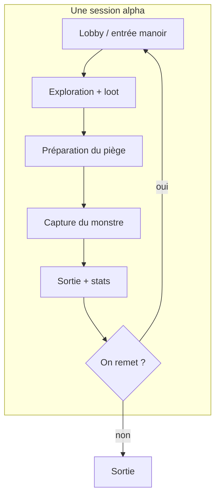

# 01 — Vision

← [Index](README.md) · [Loop de partie →](02-loop-de-partie.md)

---

## Pitch

**The Mansion** est un jeu d’horreur coop Roblox : les joueurs explorent un manoir, lootent, préparent des pièges, puis capturent le monstre de la partie.

`[À REMPLIR — pitch 1–2 phrases version “store Roblox”]`

---

## Vision joueur

Ce que le joueur doit **ressentir** pendant une session :

| Sentiment | Priorité | Notes |
|-----------|----------|-------|
| Peur / tension | Haute | Ambiance manoir, screamers, monstre |
| Fun social / “on remet ?” | Haute `[VALIDÉ]` | Rejouer pour le moment, pas pour farm |
| Satisfaction de chasse | Haute `[VALIDÉ]` | Capture = climax de la run |
| Exploration | Moyenne | Pièces distinctes, loot, préparation |

**Intention de rétention :** `[VALIDÉ]` Les joueurs reviennent parce que la session est bonne à vivre / à raconter (ambiance, moments forts, potes), **pas** parce qu’il y a une boucle de farm.

---

## Ce que le jeu EST

- Jeu d’horreur sur **Roblox** `[VALIDÉ]`
- Cadre : un **manoir** (build type Doors) + créatures démoniaques `[VALIDÉ]`
- Structure alpha : **un seul étage**, pièces en tuiles **12×12** `[VALIDÉ]`
- Gameplay central : **chasser / capturer 1 monstre par partie** `[VALIDÉ]`
- Présence de **screamers** (détails encore ouverts)
- Phase actuelle : **version alpha**

---

## Ce que le jeu N’EST PAS (pour l’instant)

| Non-objectif | Statut |
|--------------|--------|
| Clone de Luigi’s Mansion (aspirateur / stun) | `[VALIDÉ]` — on s’en éloigne |
| Jeu de farm / grind de ressources | `[VALIDÉ]` — non |
| Multi-étages / verticalité | Hors alpha connue |
| Génération procédurale | `[PLUS TARD]` |
| Mode histoire scripté | `[PLUS TARD]` |

---

## Inspirations

| Référence | Ce qu’on garde | Ce qu’on refuse | Statut |
|-----------|----------------|-----------------|--------|
| Doors | Build de manoir / couloirs / pièces, tension d’exploration | Copie 1:1 des entités Doors | `[VALIDÉ]` |
| Demonology | Monstres démoniaques, chasse / pièges, feel “enquête + danger” | Complexité pure ghost-hunt hardcore si elle casse l’accessibilité Roblox | `[VALIDÉ]` |
| Luigi’s Mansion | Idée large “chasse dans un manoir” | Aspirateur / structure puzzle Nintendo | Éloignement voulu |

---

## Public cible

| Champ | Valeur |
|-------|--------|
| Âge / persona Roblox | `[À REMPLIR]` |
| Solo / multi | `[À REMPLIR — co-op attendu, à confirmer]` |
| Session type (durée) | **10–15 min** `[VALIDÉ]` |
| Ton | Horreur manoir + créatures démoniaques ; palette exacte `[À REMPLIR]` |

---

## Schéma de vision

---

## Liens

- Loop détaillée → [02 — Loop de partie](02-loop-de-partie.md)
- Décisions ouvertes → [08 — Ouvertes & roadmap](08-ouvertes-et-roadmap.md)
