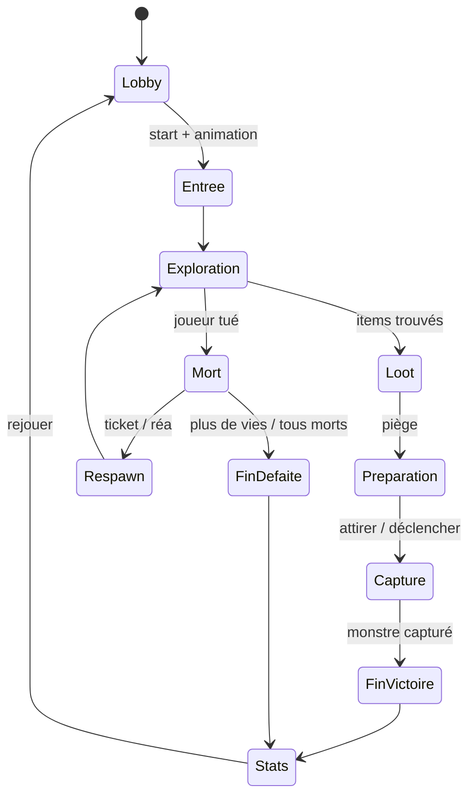

# 02 — Loop de partie

← [Vision](01-vision.md) · [Index](README.md) · [Monde & build →](03-monde-et-build.md)

---

## Contenu d’une partie `[VALIDÉ]`

Ordre de gameplay :

1. **Exploration** du manoir
2. **Loot / recherche d’items**
3. **Préparation du piège**
4. **Capture du monstre**

---

## Boucle de session

### Paramètres `[VALIDÉ]`

| Paramètre | Valeur |
|-----------|--------|
| Durée cible d’une loop | **10–15 min** |
| Condition de victoire | **Capturer le monstre** |
| Condition de défaite | **Mourir** / **tout le monde meurt** |
| Monstres par partie | **1** |
| Respawns | Tickets de respawn + **1 réanimation** possible |
| Nombre de joueurs | `[À REMPLIR — min / max]` |

---

## Lancement d’une loop `[VALIDÉ]`

1. Animation d’entrée
2. Exploration
3. Loot

---

## Mort & respawn `[VALIDÉ]`

| Règle | Détail |
|-------|--------|
| Si un joueur meurt | Possibilité de **respawn via ticket** |
| Réanimation | **1 fois** (réa) |
| Économie tickets | Voir [06 — Monétisation](06-monetisation.md) |

Détail exact du flow UI mort / spectateur : `[À REMPLIR]`

---

## Fin de loop `[VALIDÉ]`

1. Animation de fin : tout le monde se check en sortant du manoir
2. Lever du jour
3. Écran de stats
4. Proposition de rejouer

### Écran de stats (contenu)

| Élément | Inclus ? |
|---------|----------|
| Monstre de la run / capture OK | Oui (intention) |
| Survie / morts | Oui (intention) |
| Score numérique lourd / farm | Non — garder léger |
| Bouton rejouer | Oui `[VALIDÉ]` |

Détail exact des lignes de stats : `[À REMPLIR]`

---

## Compréhension / onboarding

| Outil | Statut | Notes |
|-------|--------|-------|
| Carte expliquant comment tuer les monstres | `[VALIDÉ]` (prévu) | Aide in-run ou lobby |
| Info-bulles au-dessus de la hotbar (tips) | `[VALIDÉ]` (prévu) | |
| Tutoriel dédié | `[PLUS TARD]` | Proposition pour une update |

---

## Rythme (indicatif)

| Phase | Durée indicative | Intensité |
|-------|------------------|-----------|
| Entrée | Court | Basse |
| Exploration + loot | Majorité du temps | Moyenne |
| Préparation piège | 2–4 min | Moyenne → haute |
| Capture | Climax | Haute |
| Sortie / stats | Court | Basse / soulagement |
