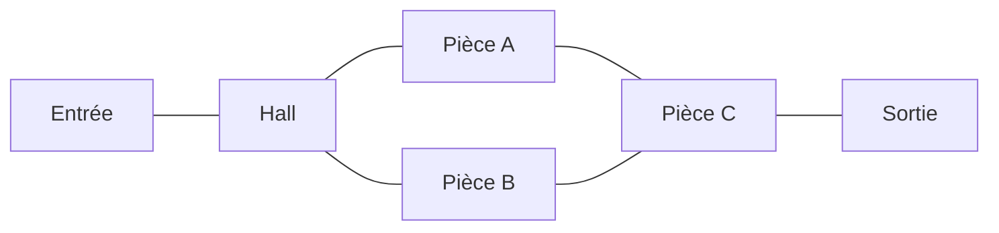

# 03 — Monde & build

← [Loop](02-loop-de-partie.md) · [Index](README.md) · [Monstres →](04-monstres.md)

---

## Direction artistique

| Élément | Décision | Statut |
|---------|----------|--------|
| Thème build | Manoir type **Doors** | `[VALIDÉ]` |
| Thème créatures | **Demonology** (monstres démoniaques + autres) | `[VALIDÉ]` |
| Palette / couleurs générales | — | `[À REMPLIR]` |
| Ton gore | — | `[À REMPLIR]` |
| Éclairage | — | `[À REMPLIR]` |

---

## Grille & pièces `[VALIDÉ]`

| Paramètre | Valeur |
|-----------|--------|
| Taille des pièces / tuiles | **12×12** |
| Nombre d’étages (alpha) | **1** |
| Nombre de pièces | `[À REMPLIR]` |
| Style de plan | `[À REMPLIR — couloirs, ailes, boucle…]` |

### Règles de level design

- Pièces basées sur une grille **12×12** `[VALIDÉ]`
- `[À REMPLIR — ex. chaque pièce a 1 événement max]`
- `[À REMPLIR — rythme screamers / respiration]`

---

## Lobby `[VALIDÉ]`

| Zone | Description |
|------|-------------|
| Lobby principal | **Manoir dans le fond**, entouré d’une **forêt** |
| Création de lobby joueur | Les joueurs peuvent créer un lobby dans un **cimetière** |

Détails UI lobby (boutons, parties privées, codes) : `[À REMPLIR]`

---

## Inventaire des pièces

> Une ligne = une pièce. Compléter au fur et à mesure du build.

| ID | Nom | Rôle gameplay | Screamer ? | Notes | Statut build |
|----|-----|---------------|------------|-------|--------------|
| R01 | `[À REMPLIR — Hall]` | | | | |
| R02 | `[À REMPLIR]` | | | | |
| R03 | `[À REMPLIR]` | | | | |

### Carte logique (placeholder)

Remplacer dès que le vrai plan existe.

---

## Identité / branding

| Élément | Valeur |
|---------|--------|
| Nom affiché | The Mansion |
| Sous-titre | `[À REMPLIR]` |
| Logo | `[À REMPLIR]` |
| Description page Roblox | `[À REMPLIR]` |
| Icône / thumbnail | `[À REMPLIR]` |
