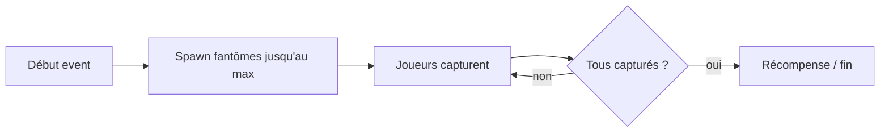

# 07 — Events

← [Monétisation](06-monetisation.md) · [Index](README.md) · [Ouvertes →](08-ouvertes-et-roadmap.md)

---

## Event — Capture de fantômes `[VALIDÉ]` (intention)

Remettre la mécanique de **capturer plein de fantômes** dans un format event.

| Paramètre | Valeur |
|-----------|--------|
| Objectif | Attraper **tous** les fantômes |
| Limite | Un **max de fantômes** (quota) par event / run event |
| Lien avec la loop normale | Mode / overlay event — détail `[À REMPLIR]` |
| Récompenses | `[À REMPLIR]` |
| Durée / saisonnalité | `[À REMPLIR]` |

### Flow indicatif

---

## Autres events

| Idée | Priorité | Statut |
|------|----------|--------|
| Events saisonniers | `[À REMPLIR]` | Backlog |
| `[À REMPLIR]` | | |
