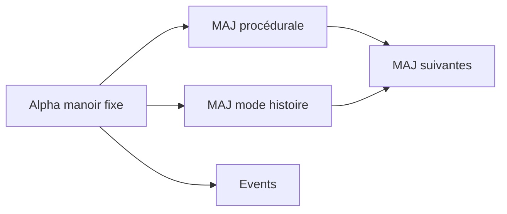

# 08 — Ouvertes & roadmap

← [Events](07-events.md) · [Index](README.md) · [Technique →](09-technique.md)

---

Quand c’est tranché : marquer **Décidé**, reporter dans la page concernée, puis archiver dans l’historique ci-dessous.

## Priorité haute (bloquant / shape alpha)

| # | Question | Notes | Décision |
|---|----------|-------|----------|
| Q1 | Solo, co-op, ou les deux dès l’alpha ? | | |
| Q2 | Joueurs min / max | | |
| Q3 | Un screamer peut-il tuer ? | | |
| Q4 | Règles générales des screamers | Rythme, triggers | |
| Q5 | Combien de pièces minimum pour l’alpha jouable ? | | |

---

## Priorité moyenne

| # | Question | Notes | Décision |
|---|----------|-------|----------|
| Q6 | Palette / ambiance couleurs | Design d’ambiance | |
| Q7 | Piles pour la lumière ? | Item | |
| Q8 | Détail exact blocage Marcheur | Étape 2 de l’exemple | |
| Q9 | Contenu exact écran de stats | | |
| Q10 | UI lobby (codes, privé, etc.) | | |

---

## Priorité basse / post-prototype

| # | Question | Notes | Décision |
|---|----------|-------|----------|
| Q11 | Lampe ×2 / pass de combat / skins | Shop | |
| Q12 | Ce que la “thune” achète | Économie | |
| Q13 | Accessibilité (réduction screamers, sous-titres) | | |
| Q14 | Lore des ailes / nom des zones | | |

---

## Décisions tranchées (historique)

| Question | Décision | Documenté dans |
|----------|----------|----------------|
| Thème | Doors (build) + Demonology (monstres) | [01](01-vision.md), [03](03-monde-et-build.md) |
| Tuiles | 12×12 | [03](03-monde-et-build.md) |
| Monstres / partie | 1 | [04](04-monstres.md) |
| Marcheur / Crieur | Design + comportement + exemples de chasse | [04](04-monstres.md) |
| Lobby | Manoir + forêt ; création lobby cimetière | [03](03-monde-et-build.md) |
| Loop | Exploration → loot → piège → capture ; 10–15 min | [02](02-loop-de-partie.md) |
| Win / lose | Capture / morts | [02](02-loop-de-partie.md) |
| Respawn | Tickets + 1 réa | [02](02-loop-de-partie.md) |
| Fin de loop | Anim sortie + jour + stats + rejouer | [02](02-loop-de-partie.md) |
| Aide | Carte + tips hotbar ; tuto plus tard | [02](02-loop-de-partie.md), [05](05-systemes.md) |
| Monétisation | VIP, tickets, packs paliers | [06](06-monetisation.md) |
| Event fantômes | Quota à tous capturer | [07](07-events.md) |
| 1 étage alpha | Oui | [03](03-monde-et-build.md) |
| Pas de farm comme rétention | Oui | [01](01-vision.md) |
| Pas procédural / histoire en alpha | Oui | ci-dessous |

---

## Objectif alpha (produit)

En une phrase :  
`[À REMPLIR — ex. “Une nuit jouable à X joueurs avec 1 monstre capturable et une fin de run claire”]`

### Critères de “alpha jouable”

- [ ] Le manoir (1 étage) est traversable
- [ ] Tuiles / pièces 12×12 en place
- [ ] Au moins 1 monstre (Marcheur ou Crieur) chassable de bout en bout
- [ ] Loop : exploration → loot → piège → capture
- [ ] Win / lose / stats / rejouer clairs
- [ ] `[À REMPLIR]`

### Jalons

| Jalon | Livrable | Date | Owner | Statut |
|-------|----------|------|-------|--------|
| Prototype 1 monstre | 1 capture test complète | `[À REMPLIR]` | | |
| Bloc manoir alpha | Pièces connectées 12×12 | `[À REMPLIR]` | | |
| First playtest | `[À REMPLIR]` | | | |
| Alpha publiable | Build stable | `[À REMPLIR]` | | |

---

## Roadmap post-alpha

| Phase | Focus | Statut |
|-------|-------|--------|
| Alpha | Manoir fixe, 1 monstre/run, loop capture | En cours |
| MAJ procédurale | Génération / variation du manoir | `[PLUS TARD]` |
| MAJ histoire | Mode scripté | `[PLUS TARD]` |
| Events | Ex. fantômes | Intention connue |

### Ce qui ne doit PAS glisser dans l’alpha

- [ ] Procédural complet
- [ ] Campagne scriptée complète
- [ ] Battle pass lourd / farm
