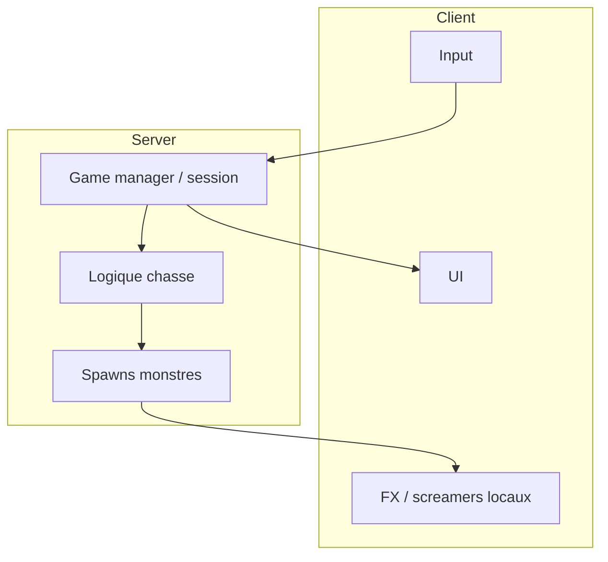

# 09 — Technique

← [Ouvertes](08-ouvertes-et-roadmap.md) · [Index](README.md)

---

Section volontairement **peu spéculative**. Remplir avec la stack réelle du projet Roblox.

## Identité projet Roblox

| Champ | Valeur |
|-------|--------|
| Nom place / expérience | The Mansion |
| Place ID | `[À REMPLIR]` |
| Universe ID | `[À REMPLIR]` |
| Groupe / propriétaire | `[À REMPLIR]` |
| Lien expérience | `[À REMPLIR]` |
| Visibilité (privé / public) | `[À REMPLIR]` |

---

## Stack & outils

| Domaine | Choix |
|---------|-------|
| Langage | `[À REMPLIR — Luau]` |
| Structure scripts | `[À REMPLIR — Script / LocalScript / ModuleScript]` |
| Rojo / Argon / autre sync | `[À REMPLIR]` |
| Git + Roblox | `[À REMPLIR — workflow]` |
| UI framework | `[À REMPLIR — plain GUI / Fusion / React-lua / …]` |
| Audio pipeline | `[À REMPLIR]` |
| Assets (Blender, etc.) | `[À REMPLIR]` |

---

## Architecture (haute niveau)



`[À REMPLIR]` — remplacer par l’archi réelle (noms de modules, folders ReplicatedStorage, etc.).

### Arborescence prévue

```
[À REMPLIR]
ReplicatedStorage/
  ...
ServerScriptService/
  ...
StarterPlayer/
  ...
Workspace/
  Manor/
    ...
```

---

## Systèmes techniques à lister

| Système | Responsable | Priorité | Notes / modules |
|---------|-------------|----------|-----------------|
| Chargement manoir / pièces 12×12 | `[À REMPLIR]` | | |
| Trigger screamers | `[À REMPLIR]` | | |
| IA / comportement monstre | `[À REMPLIR]` | | |
| Capture / validation serveur | `[À REMPLIR]` | | |
| Session start/end + stats | `[À REMPLIR]` | | |
| Tickets / VIP / DataStore | `[À REMPLIR]` | | |
| UI HUD + tips hotbar | `[À REMPLIR]` | | |
| Son 3D | `[À REMPLIR]` | | |
| Anti-exploit capture | `[À REMPLIR]` | | |

---

## Performance & contraintes Roblox

| Sujet | Budget / règle |
|-------|----------------|
| Joueurs max serveur | `[À REMPLIR]` |
| Parts / draw calls cibles | `[À REMPLIR]` |
| StreamingEnabled | `[À REMPLIR]` |
| Sons simultanés max | `[À REMPLIR]` |
| Mobile low-end | `[À REMPLIR — tests prévus]` |

---

## Networking

| Donnée | Authority | Réplication |
|--------|-----------|-------------|
| Position monstre | `[À REMPLIR]` | |
| État capture | Server (recommandé) | `[À REMPLIR]` |
| Screamer trigger | `[À REMPLIR]` | |
| Porte ouverte/fermée | `[À REMPLIR]` | |
| Tickets / achats | Server | `[À REMPLIR]` |

---

## Contenu procédural (préparation future)

Même si hors alpha, noter tôt les contraintes :

| Contrainte pour plus tard | Note |
|---------------------------|------|
| Pièces = modules 12×12 connectables ? | `[À REMPLIR]` |
| Points de spawn tagués | `[À REMPLIR]` |
| Validation navmesh / path | `[À REMPLIR]` |
| Budget pièces générées | `[À REMPLIR]` |

---

## Qualité / tests

| Type de test | Comment | Fréquence |
|--------------|---------|-----------|
| Playtest interne | `[À REMPLIR]` | |
| Test mobile | `[À REMPLIR]` | |
| Test multi | `[À REMPLIR]` | |
| Checklist publish | `[À REMPLIR]` | |

### Checklist publish (template)

- [ ] Pas d’erreurs output critiques
- [ ] Screamers ne softlock pas
- [ ] Capture validée côté serveur
- [ ] UI lisible téléphone
- [ ] Tickets / monétisation testés en studio
- [ ] `[À REMPLIR]`

---

## Liens techniques utiles

| Ressource | URL / chemin |
|-----------|--------------|
| Place de dev | `[À REMPLIR]` |
| Drive assets | `[À REMPLIR]` |
| Board tâches | `[À REMPLIR]` |
| Ce repo GDD | `gdd/` |
| Site (lecteur GDD) | `gdd.html` via GitHub Pages |
